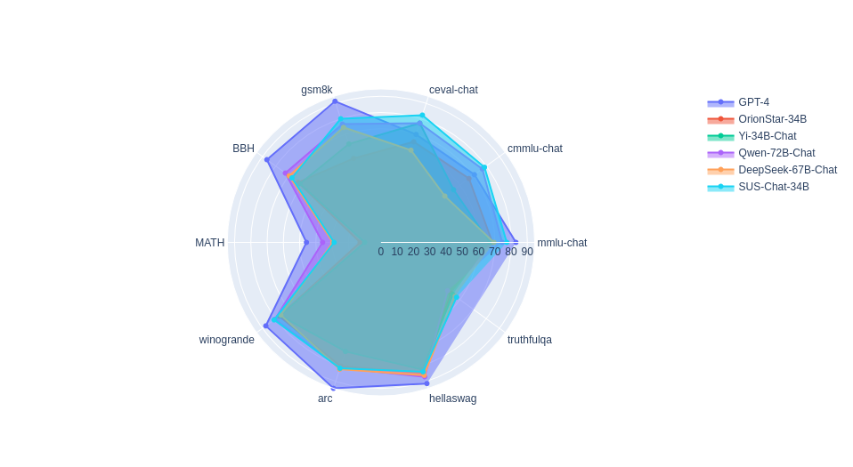

# 🐷SUS-Chat: Instruction tuning done right

<p align="left">
中文</a>&nbsp ｜ &nbsp<a href="README.md">English</a>&nbsp
</p>

<br><br>

<div align="center">

<p align="center">


</p>

<div style="display: inline-block;">

<a rel="noopener nofollow" href="https://github.com/SUSTech-IDEA/SUS-Chat/issues">

</a>

</div>

<div style="display: inline-block;">

<a href="https://huggingface.co/SUSTech">

</a>

</div>

<div style="display: inline-block;">

<a rel="noopener nofollow" href="https://www.modelscope.cn/organization/sustc/">

</a>

</div>

<div style="display: inline-block;">

<a rel="noopener nofollow" href="https://github.com/SUSTech-IDEA/SUS-Chat/blob/main/LICENSE">

</a>

</div>

<div style="display: inline-block;">

<a rel="noopener nofollow" href="https://github.com/01-ai/Yi/blob/main/MODEL_LICENSE_AGREEMENT.txt">

</a>

</div>

<div style="display: inline-block;">

<a rel="noopener nofollow" href="mailto:oss@data.sustech.edu.cn">

</a>

</div>

</div>

# 新闻

- 2023-12-06: [SUS-Chat-34B
  chat-ui](https://huggingface.co/spaces/SUSTech/SUS-Chat-34B)

- 2023-12-05: SUS-Chat-34B在[Open LLM
  leaderboard](https://huggingface.co/spaces/HuggingFaceH4/open_llm_leaderboard)排名第二，并在所有小于70B的模型中排名第一。

- 2023-12-01: SUS-Chat-34B现已在HuggingFace🤗上可用。

# 模型介绍


**SUS-Chat-34B**模型是[南方科技大学](https://huggingface.co/SUSTech)联合[IDEA研究院CCNL团队](https://huggingface.co/IDEA-CCNL)开源的通用大模型，
2023-12-05在Huggingface的权威榜单上[open_llm_leaderboard](https://huggingface.co/spaces/HuggingFaceH4/open_llm_leaderboard)取得了同级别模型最好成绩。

SUS-Chat-34B是一个340亿参数规模的双语模型，基于[01-ai/Yi-34B](https://huggingface.co/01-ai/Yi-34B)预训练模型通过数百万高质量、多语言的指令数据进行了微调。
在保持基础模型强大的语言能力的同时，SUS-Chat-34B模型通过高质量指令微调改善了模型对人类指令的响应方式，并擅长通过思维链的方式模仿人类思考过程。
与[Yi-34B](https://huggingface.co/01-ai/Yi-34B)和[Yi-34B-chat](https://huggingface.co/01-ai/Yi-34B-Chat)相比，它不仅在几乎所有基准测试中提升了性能，而且能够更好地满足了复杂多语言任务的实际需求。
在指令微调阶段，我们加入了大量高质量长文本和多轮对话指令数据，将文本窗口从基础模型的4K扩展到8K。
这种扩展有助于模型更有效地遵循多轮对话中的指令，显著减少在扩展对话和长文本理解中上下文丢失的问题。为此我们也开发了更高效的训练框架，不久也将进行开源，敬请期待。

SUS-Chat-34B模型具有以下亮点： 1. 大规模复杂指令跟随数据：使用1.4B
token的高质量复杂指令数据进行训练，涵盖中英文、多轮对话、数学、推理等多种指令数据；
2.
强大的通用任务性能：SUS-Chat-34B模型在众多主流的中英文任务上表现出色，其效果超越了相同参数规模的其他开源的指令微调模型。即使与更大参数规模的模型相比，SUS-Chat-34B模型也具有不错的竞争力；
3.
更长的上下文窗口与出色的多轮对话能力：目前，SUS-Chat-34B原生支持8K的上下文窗口，在大量多轮指令以及单多轮混合数据中进行训练，具有出色的长文本对话信息关注与指令跟随能力。

SUS-Chat-34B模型有力地证明了通过正确的指令微调，学术机构可以在不增加模型参数的情况下，通过开源的数据集和模型，获得更好的性能,
这弥合了学术界和工业界的在大语言模型上的差距，为学术界和工业界的合作提供了新的可能性。

# 模型性能

为了更好地评估SUS-Chat-34B模型的性能，我们在多个基准测试中进行了评估，并开源了评估框架[TLEM](https://huggingface.co/spaces/SUSTech/tlem)，以便于其他研究人员进行复现和比较。

在TLEM中，我们使用了多个基准测试，包括：MMLU, CMMLU, C-Eval, BBH,
GSM-8K, MATH,
专注于衡量模型的知识和思维能力，在这些指标中SUS-Chat-34B模型取得了最先进的表现，我们还额外引入了[lm-eval](https://github.com/EleutherAI/lm-evaluation-harness)测试了SUS-Chat和同类模型在winogrande,
hellaswag, arc, truthful-qa的表现, 衡量模型的常识性推理能力和幻觉。

综合上看，SUS-Chat-34B模型显著领先于同规模的模型，并取得了最先进的综合性能。


以下是评测结果：

## 英文理解能力

|                 Model |    mmlu (0-shot)    |
|----------------------:|:-------------------:|
|                 GPT-4 |         83          |
|          SUS-Chat-34B | $\underline{74.35}$ |
|         Qwen-72b-Chat |      **74.52**      |
|     Deepseek-68b-Chat |        69.43        |
| OrionStar-Yi-34B-Chat |        68.51        |
|           Yi-34B-Chat |        66.96        |

## 中文能力

|                 Model |   cmmlu (0-shot)    |   C-Eval (0-shot)   |
|----------------------:|:-------------------:|:-------------------:|
|                 GPT-4 |         71          |        69.9         |
|          SUS-Chat-34B |      **78.68**      |      **82.42**      |
|         Qwen-72b-Chat | $\underline{77.02}$ | $\underline{77.22}$ |
|     Deepseek-68b-Chat |        48.51        |        59.7         |
| OrionStar-Yi-34B-Chat |        66.88        |        65.13        |
|           Yi-34B-Chat |        55.16        |        77.16        |

## 数学与推理能力

在GSM8K（数学逻辑）的评测都是目前开源模型最强。

|                 Model |   gsm8k (0-shot)    |    MATH (0-shot)    |    BBH (0-shot)     |
|----------------------:|:-------------------:|:-------------------:|:-------------------:|
|                 GPT-4 |        91.4         |        45.8         |        86.7         |
|          SUS-Chat-34B |      **80.06**      |        28.7         |        67.62        |
|         Qwen-72b-Chat | $\underline{76.57}$ |      **35.9**       |      **72.63**      |
|     Deepseek-68b-Chat |        74.45        | $\underline{29.56}$ | $\underline{69.73}$ |
| OrionStar-Yi-34B-Chat |        54.36        |        12.8         |        62.88        |
|           Yi-34B-Chat |        63.76        |        10.02        |        61.54        |

## 其他任务能力

|                 Model | winogrande (5-shot) |    arc (25-shot)    | hellaswag (10-shot) | TruthfulQA mc1 (0-shot) | TruthfulQA mc2 (0-shot) |
|----------------------:|:-------------------:|:-------------------:|:-------------------:|:-----------------------:|:-----------------------:|
|                 GPT-4 |          —          |        94.5         |        91.4         |          59.00          |            —            |
|          SUS-Chat-34B |      **81.22**      | $\underline{81.54}$ |        83.79        |        **40.64**        |        **57.47**        |
|         Qwen-72b-Chat |        76.09        |      **82.10**      | $\underline{86.06}$ |          39.17          |   $\underline{56.37}$   |
|     Deepseek-68b-Chat | $\underline{80.58}$ |        81.29        |      **87.02**      |   $\underline{40.02}$   |          50.64          |
| OrionStar-Yi-34B-Chat |        77.27        |        80.19        |        84.54        |          36.47          |          53.24          |
|           Yi-34B-Chat |        76.64        |        70.66        |        82.29        |          38.19          |          54.57          |

## 综合能力

|                 Model |  Average  |
|----------------------:|:---------:|
|          SUS-Chat-34B | **69.05** |
|         Qwen-72b-Chat |   68.41   |
|     Deepseek-68b-Chat |   62.91   |
| OrionStar-Yi-34B-Chat |   60.21   |
|           Yi-34B-Chat |   59.72   |

# 用法

SUS-Chat-34B是标准的LLaMA模型，应该可以无缝地与LLaMA生态系统兼容，我们提供下面的例子来展示如何使用它进行多轮对话

``` python
from transformers import AutoModelForCausalLM, AutoTokenizer


def chat_template(messages):
    history = ""
    for message in messages:
        match message:
            case {"role": "user", "content": message}:
                history += f"### Human: {message}\n\n### Assistant: "
            case {"role": "assistant", "content": message}:
                history += message
    return history


model_path = "SUSTech/SUS-Chat-34B"

tokenizer = AutoTokenizer.from_pretrained(model_path, use_fast=False)
model = AutoModelForCausalLM.from_pretrained(
    model_path, device_map="auto", torch_dtype="auto"
).eval()

messages = [{"role": "user", "content": "hi"}]

input_ids = tokenizer.encode(
    chat_template(messages), return_tensors="pt", add_special_tokens=False
).to("cuda")
output_ids = model.generate(input_ids.to("cuda"), max_length=256)
response = tokenizer.decode(
    output_ids[0][input_ids.shape[1] :], skip_special_tokens=False
)

messages.append({"role": "assistant", "content": response})

# Second round

messages.append({"role": "user", "content": "What is the capital of China?"})

input_ids = tokenizer.encode(
    chat_template(messages), return_tensors="pt", add_special_tokens=False
).to("cuda")
output_ids = model.generate(input_ids.to("cuda"), max_length=256)
response = tokenizer.decode(
    output_ids[0][input_ids.shape[1] :], skip_special_tokens=False
)

messages.append({"role": "assistant", "content": response})
```

# 限制

SUS-Chat只进行了监督微调，尚未进行人类偏好学习，因此在一些情况下可能会产生不合理的回复，并放大某些语言模型现有的问题,
包括幻觉、非确定性和累积误差,
为了实现更有利于下游任务的性能，我们建议相应地调整生成配置参数。

# 免责声明

我们在训练过程中使用数据合规检查算法，尽力确保训练模型的合规性。由于数据复杂且语言模型使用场景多样，我们无法保证模型在所有情况下生成正确和合理的输出。请注意，模型仍然存在产生问题输出的风险。对于因滥用、误导、非法使用和相关错误信息以及相关数据安全问题而导致的任何风险和问题，我们将不承担责任。

# 许可

该模型完全开发供学术研究和免费商业使用，但需要遵守来自[零一万物](https://huggingface.co/01-ai)的[许可](https://github.com/01-ai/Yi/blob/main/MODEL_LICENSE_AGREEMENT.txt)
